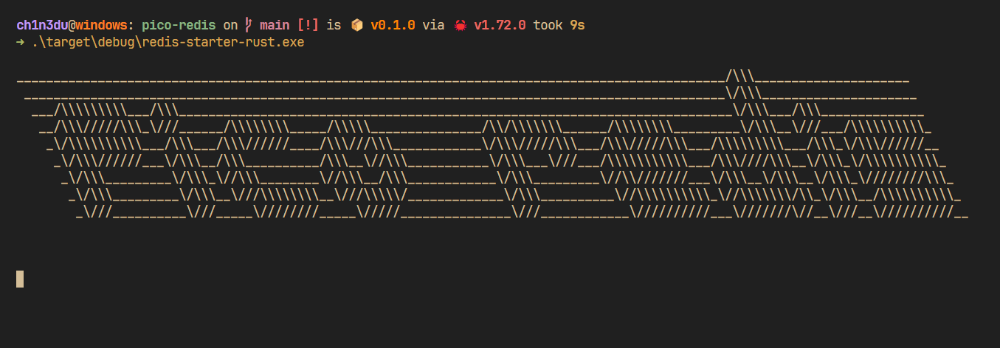

# pico-redis



A tiny reimplentation of [Redis](https://redis.io/).
My main goal with this was to learn more about async programming in Rust using [Tokio](https://tokio.rs).
[`src/app.rs`](./src/app.rs) contains most of the logic.

>**Note:** This is a very naive implementation, the database is just a non-sharded hashmap.

## Running the code

Make sure you have [Rust installed](https://rustup.rs/) and run:

```sh
$ cargo run
  ...
```

## Supported Commands

- [PING](https://redis.io/commands/ping/)
- [ECHO](https://redis.io/commands/echo/)
- [SET](https://redis.io/commands/set/)
- [GET](https://redis.io/commands/get/)

## Possible Future stuff

There's a lot of room for optimizations with stuff like [LSM-trees](https://en.wikipedia.org/wiki/Log-structured_merge-tree) but I don't yet have the time to [learn](https://skyzh.github.io/mini-lsm/) how to implement them.
